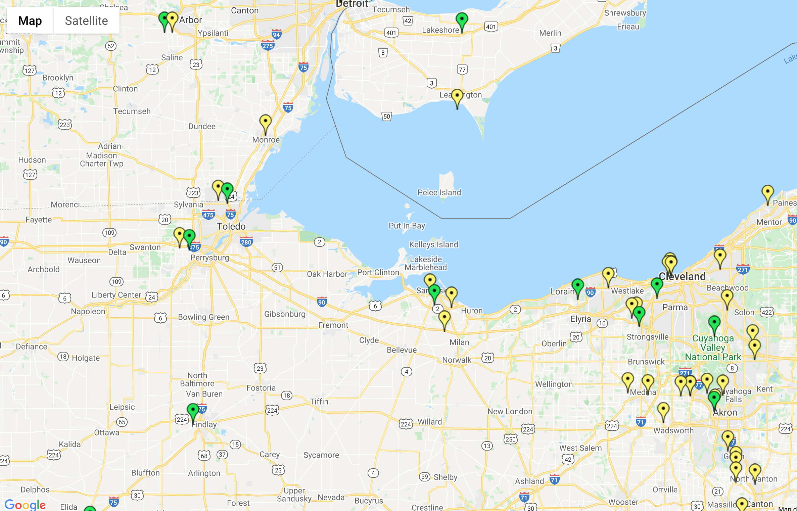

# Tesla Charging Locations

A quick and dirty plot of Tesla charging stations worldwide.

## The Problem

My friend is curious about how much coverage Tesla owners have when charging their vehicles on the go. He wants a visual representation of the kinds of charging stations that are available across the country.

## The Solution

It happens that Tesla provides a complete listing of all charging stations worldwide as a [JSON-formatted document](https://www.tesla.com/all-locations). This document includes, among other things, the names, coordinates, and types (standard or Supercharger) of each charging station. By simply grabbing this data and overlaying it onto a Google map, my friend now has a rudimentary visual representation of charging stations.



The image above shows a sample plot of the dataset. Locations in green are Superchargers, and the ones in yellow are standard chargers.


## Installation

To run the application locally:

1. Clone this repository.
```
$ git clone https://github.com/realgregmundy/tesla-charging-locations.git
```
2. Install dependencies.
```
$ yarn install
```

3. Start the application
```
$ yarn start
```


